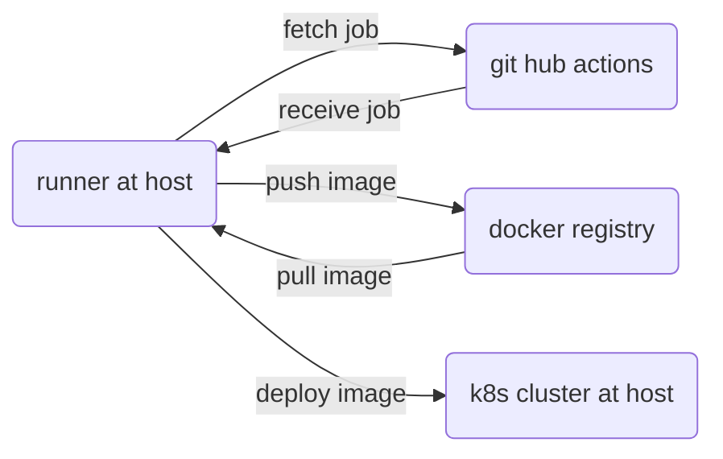

# GitHubActions pipeline with Flask (backend) and React (frontend) apps


## Architecture



## Clone project 

```bash
gh repo clone sauravdwivedi/GitHubActions
```

## Setup git repo 

Copy project directory to a git repo and configure that repo from Actions tab.

## Setup Docker Hub credentials

In github under Settings > Secrets and variables > actions, create Repository secrets

```yaml
DOCKERHUB_USERNAME: <<username of your docker hub account>>
DOCKERHUB_TOKEN: <<Access token generated from docker hub under My Account > Security > Access Tokens>>
```

## Setup self hosted runner

- https://docs.github.com/en/actions/hosting-your-own-runners/managing-self-hosted-runners/adding-self-hosted-runners

Create alias for self host runner

```bash
alias actions=/Users/sdwivedi/actions-runner/run.sh
```

run actions in terminal for pipeline to pick up the job. Docker and a kubernetes cluster must be up and running on the host.

## Backend and Frontend apps

If GitHubActions pipeline works fine, then backend and frontend apps run on

- http://127.0.0.1:5000/api/v1/ui/
- http://127.0.0.1:3000

## GitHubActions console output


## GitHubActions syntax

- https://docs.github.com/en/actions/using-workflows/workflow-syntax-for-github-actions